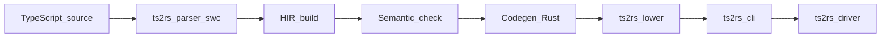

[中文](README.zh-CN.md)

# ts2rs

Experimental **TypeScript → Rust source** compiler (implemented in Rust), then **cargo/rustc** to produce executables. This repository is often used as the **trust** subset in engineering.

See also [CONTRIBUTING.md](CONTRIBUTING.md), [CHANGELOG.md](CHANGELOG.md), and the long-term roadmap [PROJECT-TODO.md](PROJECT-TODO.md) ([中文](PROJECT-TODO.zh-CN.md)).

## Trust: hard typing

**trust is hard-typed; there is no soft typing.** Supported programs must have **static, definite** type information at compile time: parameters and return types must be annotated (or equivalently decidable in this subset); `let` / `const` require type annotations (or definite initialization with inferable types). There is **no** implicit `any`, runtime reshaping, or “infer later and widen globally” soft semantics. Validation is **static type checking**, not full TypeScript / `tsc` progressive looseness.

## Architecture

Parse (swc) → **HIR** ([`ts2rs-hir`](crates/ts2rs-hir)) → **semantic checks** (symbols, types, simplified return paths) → **Rust codegen** → **cargo** link.

Optional runtime [`ts2rs_rt`](crates/ts2rs_rt): generated code does **not** depend on this crate today; it exposes placeholder APIs such as `read_stdin_line`. Console: `console.log` → `println!`, `console.error` / `console.debug` → `eprintln!`.



[`ts2rs-lower`](crates/ts2rs-lower) wires HIR build, semantics, and codegen. [`ts2rs-driver`](crates/ts2rs-driver) builds a temporary crate and runs `cargo` (used by `ts2rs run`).

## Unsupported TypeScript (trust rejection boundary)

Common forms that are **explicitly rejected** (diagnostics are English; see [`build.rs`](crates/ts2rs-hir/src/build.rs) / [`sem.rs`](crates/ts2rs-hir/src/sem.rs)). This table complements the **generics** table below and the language matrix.

| User-visible form | Notes |
|-------------------|--------|
| `export` other than `export function` / top-level `function` | e.g. `export { }`, `export default`, `export * from`, `export const` / `class` |
| Advanced generics | Complex inference/constraints and full TS generic semantics are still out of scope (basic monomorphization subset is supported below) |
| Optional call | `f?.()` — optional **member** `obj?.prop` is partially supported |
| `interface` `extends`, optional props, imported interface names across files | Single-file nominal table only |
| Intersection `A & B` | Rejected |
| `bigint`, template literal types in type positions | Rejected |
| Full `tsc` / structural typing / higher-order function values | Not implemented |

## Scope (1.0)

- **Matrix coverage**: rows marked Supported / Partially supported have representative **fixtures** ([`fixtures/`](crates/ts2rs-cli/tests/fixtures/)) and **[`cli_e2e.rs`](crates/ts2rs-cli/tests/cli_e2e.rs)** tests; see **[Matrix vs integration tests](#matrix-vs-integration-tests)**. Larger examples: [`test-ts/main.ts`](test-ts/main.ts), [`test-ts/math.ts`](test-ts/math.ts). **Regression** cases: [`tests/regression/`](crates/ts2rs-cli/tests/regression/).
- **Diagnostics**: compile **errors** are **English**, `path:line:col: message` ([`CompileError`](crates/ts2rs-hir/src/error.rs)). **Warnings** (e.g. unreachable code) use the same shape via [`CompileWarning`](crates/ts2rs-hir/src/error.rs); on success the CLI prints warnings to **stderr** and does **not** change exit code.
- **CI**: pushes and PRs run `cargo fmt --all --check`, `cargo test --workspace`, and `cargo clippy --workspace --all-targets` ([`.github/workflows/ci.yml`](.github/workflows/ci.yml)).
- **Not 1.0**: full `tsconfig` (`extends` / `include` glob), package resolution, `export *`, etc. **Relative** `import { x } from "./dep.ts"` is supported; the CLI supports **multiple roots**: several `.ts` arguments or a minimal JSON (`files` only) with `--project` ([`parse_module_graph_with_extra_roots`](crates/ts2rs-parser/src/module_graph.rs) + `validate_imports`, HIR [`compile_graph`](crates/ts2rs-hir/src/lib.rs)); entry must define `main`, global function names unique.

## Diagnostics and surface (§1.1)

- **Single error**: [`ts2rs_hir::compile`](crates/ts2rs-hir/src/lib.rs) / [`compile_graph`](crates/ts2rs-hir/src/lib.rs) report the **first** error only ([`CompileError`](crates/ts2rs-hir/src/error.rs)). On success, multiple [`CompileWarning`](crates/ts2rs-hir/src/error.rs) may be returned (same shape in [`ts2rs_lower`](crates/ts2rs-lower/src/lib.rs)).
- **`export` shapes**: anything other than `export function …` and top-level `function …` is rejected ([`build.rs`](crates/ts2rs-hir/src/build.rs)); negative fixtures `export_*_fail.ts` and [`cli_e2e.rs`](crates/ts2rs-cli/tests/cli_e2e.rs).
- **Comments**: swc `Program` has **no** comment nodes; [`ParsedSource`](crates/ts2rs-parser/src/lib.rs) includes `source_map` for locations. Reflecting TS comments in Rust is **not** implemented.

## Control flow and return (§3.4)

Implemented in [`sem.rs`](crates/ts2rs-hir/src/sem.rs) (`fn_body_returns`, `tail_returns_last_only`, `tail_returns_while_body`, `stmt_block_diverges`, etc.).

- **Non-void functions**: [`check_function`](crates/ts2rs-hir/src/sem.rs) requires `fn_body_returns(&f.body, &ret)` or errors (“not all control paths return…”).
- **Early exhaustive return**: if an earlier statement guarantees a value return on all paths (e.g. full `if` / `else` with `fn_body_returns` on both), the rest may only produce **unreachable** warnings; see `early_return_unreachable.ts`.
- **Tail rules**: if no such early return, the **last reachable statement** must satisfy the simplified return rules (return, `if` with both branches, block, `while` / `do-while` body per `tail_returns_while_body`). An `if` **without** `else` cannot satisfy the “last statement” rule by itself.
- **Unreachable code**: statements after `return`, `break`/`continue` (in loops), or after an `if`/`else` that exhaustively returns — warning `unreachable code`; see `unreachable_after_return.ts`, `break_unreachable.ts`.
- **`let` without init**: `let x: T;` allowed; must be assigned before read. Loops use a **conservative** assignment model. Negative: `definite_assign_fail.ts`.

Fixture pointers: `let_dup_same_block_fail.ts`, `let_shadow_nested_ok.ts`, `param_let_same_name_fail.ts`, `void_log_in_branch.ts`.

## Language feature matrix

| Feature | Status | Notes |
|---------|--------|-------|
| Single `.ts` file | Supported | |
| Top-level `function` | Supported | `export function` in-file; other `export` §1.1 |
| `import` | Partial | Only `import { name } from "./relative.ts"`; deps need `export function name`; module graph; `import_add_main.ts`, negatives `import_missing_export_*`, `circular_*` |
| `number` / `boolean` / `string` / `void` | Supported | `void` only as return; `let` cannot be `void` |
| `let` (single decl) | Partial | Type annotation required; may omit init but must assign before use (§3.4); mutable `let` → `IRStmt::Assign`; `definite_assign_ok.ts` |
| `const` | Supported | Same shape as `let`; no reassignment |
| Blocks, multiple statements | Supported | Empty `;`, blocks |
| `if` / `else`, `while`, `do-while` | Supported | Condition: `number` (truthy non-zero) or `boolean`, or same **primitive family** union (`1 \| 2`, `true \| false`), not `number \| boolean` mixed |
| C-style `for(;;)` | Supported | |
| `break` / `continue` | Supported | Must be inside a loop; no labels |
| Nested `function` | Partial | No closure capture subset; `nested_fn.ts` |
| `&&` / `\|\|` | Partial | `boolean` and `number` truthiness; result `boolean`; `logical_bool.ts`, `logical_truthy_ok.ts` |
| Ternary `?:` | Supported | Same type branches; `ternary_ok.ts` |
| Template literals | Supported | No tag; `template_ok.ts` |
| Comma expression | Supported | `comma_ok.ts` |
| Member access | Partial | `string.length` UTF-16 code units; `number[].length`; `length` on objects; no `string` indexing; `obj.m(args)` → global `m(receiver,…)`; no `obj[expr](…)`, `obj?.m(…)`; fixtures `string_utf16_length.ts`, `method_call_ok.ts`, `object_length_field.ts` |
| `?.` / `??` | Partial | `?.` member only; `??` restricted; `optional_ok.ts`, `nullish_ok.ts`; §3.3 |
| Array / object literals | Partial | `number[]`, `{ k: number }` subset; `HashMap` objects; `array_ok.ts`, `object_ok.ts` |
| `switch` | Partial | `case` only `number`/`boolean` literals; `default` last; no fall-through; `switch_ok.ts`, `switch_fail.ts` |
| `return` | Supported | `fn_body_returns` |
| `void` functions | Supported | No return-path requirement |
| `+ - * /`, compares, `!`, unary `-` | Supported | String only `+` concat; §4.1 for `/` |
| `Math.*` builtins | Partial | `math_builtin.ts` |
| `console.log` / `error` / `debug` | Supported | §4.1 |
| Literal types | Partial | `literal_type_ok.ts`; `bigint` / template literal types in type position rejected |
| Union `A \| B` | Partial | Normalization; must map to one Rust type; `number \| string` heterogeneous fails; `A & B` rejected; `union_*`, `intersection_type_fail.ts` |
| `interface` | Partial | Top-level; `TsType::ObjectNum`; `interface_ok.ts`, negatives |
| `type` alias | Partial | Shared table with `interface`; `type_alias_*.ts` |
| Generics / type args | Partial | Monomorphization subset: explicit type args required at generic call sites; generic declarations are allowed; unsupported broad shapes still rejected |
| Higher-order functions | Partial | Function type annotations and typed arrow closures are supported in current subset (`(number) => number` closure codegen path); variable-call `f(...)`, function args/returns covered by e2e fixtures |
| Full TypeScript / `tsc` | Not implemented | Long-term |

### Matrix vs integration tests

Theme → fixture → `cli_e2e` test names (`run_*`, `compile_*`, `check_*`). Full list lives in the test file.

| Theme | Representative fixtures | Representative tests |
|-------|-------------------------|-------------------------|
| Single file / ops / strings | `sample.ts`, `ops.ts`, `boolean_if.ts`, `string_concat.ts` | `compile_writes_rust`, `run_prints_main_result`, … |
| Import / multi-file | `import_add_main.ts` + `add_dep.ts`, `multi_entry_*`, `export_main.ts` | `run_import_add_main_prints_three`, … |
| Negative import/export | `import_missing_export_*`, `circular_*`, `dup_*`, `export_*_fail.ts` | `compile_import_missing_export_fails`, … |
| `let` / `const` / blocks | `const_ok.ts`, `assign_simple.ts`, `empty_stmt.ts`, `let_if.ts` | `run_const_ok_prints_42`, … |
| Semantics (shadow, void branch) | `let_dup_same_block_fail.ts`, `void_log_in_branch.ts`, … | `compile_*`, `run_void_log_in_branch_prints_branch` |
| Control flow / unreachable | `while_early.ts`, `for_loop.ts`, `early_return_unreachable.ts`, … | `run_while_early_prints_three`, … |
| Logic / ternary / template / comma | `logical_bool.ts`, `ternary_ok.ts`, … | … |
| Members / Math / length | `string_utf16_length.ts`, `math_builtin.ts`, … | … |
| `?.` / `??` | `optional_ok.ts`, `nullish_ok.ts` | … |
| Arrays / objects | `array_ok.ts`, `object_ok.ts`, `array_fail.ts` | `compile_array_return_type_mismatch_fails` |
| `switch` | `switch_ok.ts`, `switch_fail.ts` | … |
| Console | `console_stderr.ts`, `void_log.ts` | … |
| Literal / union / intersection | `literal_type_*.ts`, `union_*.ts` | … |
| Interface / type / generic subset | `interface_*.ts`, `type_alias_*.ts`, `generic_function_ok.ts` | `run_interface_generic_ok_prints_zero`, `run_type_alias_generic_ok_prints_zero`, `run_generic_function_ok_prints_three` |
| Nested function | `nested_fn.ts` | `run_nested_fn_prints_nine` |
| Minimal tsconfig / `--project` | `multi_entry_tsconfig.json`, `multi_entry_*.ts` | `run_project_tsconfig_prints_main` |
| CLI `check` / `--emit-ir` | `sample.ts`, `switch_fail.ts` | `check_sample_ok`, `compile_emit_ir_stderr_contains_ir_module` |
| Negative optional / nullish / object | `optional_chain_fail.ts`, `nullish_fail.ts`, `object_fail.ts` | `compile_optional_call_not_supported_fails`, … |
| Regression anchor | [`tests/regression/switch_fallthrough_regression.ts`](crates/ts2rs-cli/tests/regression/switch_fallthrough_regression.ts) | `regression_switch_fallthrough_check_fails` |

## Type roadmap (§1.4)

Literal types, unions, limited `interface` / `type`, and generics roadmap: [PROJECT-TODO.md §1.4](PROJECT-TODO.md). Nullable narrowing vs §3.3.

### Generics (monomorphization subset)

- Generic function declarations are accepted and instantiated by `sem` when called with explicit type arguments.
- Generic calls without explicit type arguments are rejected (e.g. `id(1)` when `id<T>`).
- Generic `interface` / `type` declarations are accepted in the current restricted type subset.
- Broader TypeScript generic semantics (inference, constraints-rich forms, higher-order generic typing) remain out of scope.

## Semantics roadmap (§3.3)

See [PROJECT-TODO.md §3.3](PROJECT-TODO.md). `??` / `?.` full narrowing is future work; `null` / `undefined` have no `strictNullChecks` switch; nominal `interface`/`type` vs structural TS; higher-order functions are currently a restricted typed subset.

## Arithmetic, `/`, overflow (§4.1)

- **`number` → `i32`** for `+`, `-`, `*`.
- **`/`**: Rust integer division, **truncate toward zero** (not TS IEEE float `1/2 === 0.5`).
- **Overflow**: `i32` range; Rust `i32` semantics (UB in release for overflow); no `checked_*` by default.
- **`console.*` multi-arg**: spaced `"{}"` formatting ([`emit_builtin_log`](crates/ts2rs-hir/src/codegen.rs)).

## Build

```bash
cargo build --release
cargo test
```

## Usage

```bash
cargo run -p ts2rs-cli -- compile path/to/app.ts -o out.rs
cargo run -p ts2rs-cli -- compile path/to/entry.ts path/to/extra.ts -o out.rs
cargo run -p ts2rs-cli -- run path/to/app.ts
cargo run -p ts2rs-cli -- run --project path/to/tsconfig.json
cargo run -p ts2rs-cli -- check path/to/app.ts
```

### CLI

| Subcommand | Role |
|------------|------|
| **`compile`** | Parse → HIR → sem → Rust written to **`-o` / `--output`** |
| **`run`** | Same, then temp crate, **`cargo build`** (default **`--release`**) and run |
| **`check`** | Parse + HIR + **semantics only**; no `.rs`, no `cargo` |

**Global** (before subcommand, e.g. `ts2rs -q run …`):

| Flag | Role |
|------|------|
| **`-q` / `--quiet`** | Suppress warnings on success (errors still stderr) |
| **`--color`** | `auto` / `always` / `never` for help styling; interacts with `NO_COLOR` |

**`compile`**: `--span-comments`, `--emit-ir` (dumps [`IRModule`](crates/ts2rs-hir/src/ir.rs) `Debug` to stderr), `--link-ts2rs-rt` (no-op for compile).

**`run`**: `--link-ts2rs-rt`; **`--debug`** → debug `cargo build`; **`-O` / `--release`** (conflicts with `--debug`).

**Exit codes**: **0** success; **1** ts2rs/driver errors; **`run`** propagates child process exit code when the binary fails; warnings do not change exit code.

- **Multi-file**: first path is **entry** (`export function main`), rest are **extra roots**.
- **Minimal tsconfig**: `--project foo.json` reads **`files`** (paths relative to the JSON); first entry is entry; mutually exclusive with extra `.ts` args.
- **`--link-ts2rs-rt`**: optional path dep on **`ts2rs_rt`** (build from this repo).

## Crate layout

| Crate | Role |
|-------|------|
| `ts2rs-parser` | swc wrapper; `source_map`; [`module_graph`](crates/ts2rs-parser/src/module_graph.rs); shared import parsing in [`import_utils`](crates/ts2rs-parser/src/import_utils.rs) |
| `ts2rs-hir` | IR, build, sem, `emit_rust`; [`compile_graph`](crates/ts2rs-hir/src/lib.rs); split helpers: [`build/build_types.rs`](crates/ts2rs-hir/src/build/build_types.rs), [`sem/helpers.rs`](crates/ts2rs-hir/src/sem/helpers.rs), [`codegen/helpers.rs`](crates/ts2rs-hir/src/codegen/helpers.rs) |
| `ts2rs-lower` | [`lower_module_graph`](crates/ts2rs-lower/src/lib.rs) |
| `ts2rs-driver` | Temp crate + `cargo` ([`compile_entrypoint_to_executable`](crates/ts2rs-driver/src/lib.rs)); pipeline split: [`pipeline.rs`](crates/ts2rs-driver/src/pipeline.rs), [`cargo_runner.rs`](crates/ts2rs-driver/src/cargo_runner.rs), [`crate_writer.rs`](crates/ts2rs-driver/src/crate_writer.rs) |
| `ts2rs_rt` | Optional runtime |
| `ts2rs-cli` | `ts2rs` binary; command split: [`cli_args.rs`](crates/ts2rs-cli/src/cli_args.rs), [`commands.rs`](crates/ts2rs-cli/src/commands.rs), [`graph_loader.rs`](crates/ts2rs-cli/src/graph_loader.rs) |

## License

MIT OR Apache-2.0
