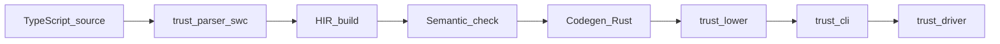

[中文](README.zh-CN.md)

# trust

Experimental **TypeScript → Rust source** compiler (implemented in Rust), then **cargo/rustc** to produce executables. This repository is often used as the **trust** subset in engineering.

See also [CONTRIBUTING.md](CONTRIBUTING.md), [CHANGELOG.md](CHANGELOG.md), and the long-term roadmap [PROJECT-TODO.md](PROJECT-TODO.md) ([中文](PROJECT-TODO.zh-CN.md)).

## Quick Start (Read This First)

### 1) Initialize a project

```bash
trust init --dir my-trust-app
cd my-trust-app
trust run main.ts
```

### 2) Add Rust extern quickly

```bash
trust add url::Url::parse
```

This updates `Trust.toml` with both:

- `[dependencies]` entry (`url = "*"`, if missing)
- `[[rust_binding]]` entry (`crate`, `type_name`, `rust_type`, `new`)

### 3) Core CLI usage

```bash
# check only (parse + HIR + sem)
trust check main.ts

# emit Rust source
trust compile main.ts -o out.rs

# build executable and run it yourself
trust compile main.ts --exec -o ./app

# one-step compile + run
trust run main.ts

# project mode
trust run --project tsconfig.json
```

## Trust vs TypeScript (What Is Different)

- Strong typing only: no implicit `any`, no “write first, infer later” soft mode.
- Subset compiler: aims for a statically-checkable/codable subset, not full `tsc` equivalence.
- Runtime model differs: `number` lowers to Rust `f64`; some JS edge cases can differ.
- Module/dependency model differs: no npm/node_modules resolution; Rust crates go through `Trust.toml`.
- Export/import is restricted: only documented supported forms; unsupported forms fail at compile time.

## Development Notes (Pitfalls)

- Always annotate function params/returns; keep local `let/const` type information explicit.
- Entry file must define `main`; in multi-file mode, first positional `.ts` is entry.
- `--project` and positional `.ts` are mutually exclusive.
- `--link-trust-rt` only matters with `compile --exec` or `run`.
- `trust add` supports `crate::Type` (type-only), `crate::Type::new_fn` (constructor `new` in `Trust.toml`), `crate::Type::method --returns … --args …` (append/replace a `method` row), and `crate::*` (nightly `cargo rustdoc` JSON to heuristically fill bindings; not the compiler reflecting crates). Rust extern method signatures remain explicit in `Trust.toml`.
- Diesel / C FFI patterns: see [`examples/orm_ffi_demo.ts`](examples/orm_ffi_demo.ts) and [`examples/crates/trust_orm_facade`](examples/crates/trust_orm_facade) / [`trust_ffi_facade`](examples/crates/trust_ffi_facade).

## Standard Library (trust Surface)

Current built-in/standardized APIs available from TS source:

Default implementation mode is `trust_stdlib` (stable facade crate). Runtime **HTTP** (`fetch` / `fetchText`), **IO** (`readLine`, `readFileText`, async read), **console**, **Math** / **Number**, and **JSON** / **URI** / **string** helpers are implemented in the [`crates/trust-stdlib`](crates/trust-stdlib) crate; generated Rust mostly calls `trust_stdlib::…`. The emitted `Cargo.toml` uses `trust_stdlib` with **`default-features = false`** and enables Cargo features **`http`** / **`async-io`** only when the program actually uses `fetch*` or `readFileTextAsync`, so sync-only programs avoid compiling **`reqwest` / `tokio`** inside the stdlib dependency graph (faster `trust run` / `compile --exec` and e2e). The CLI flag `--stdlib-mode legacy` is retained for compatibility; **lowering output matches `trust_stdlib`** (no separate inline stdlib shims).

**`import std from "std"`** (only this default-import form is valid for the virtual `"std"` module) exposes the same capabilities under a single namespace; **global-style APIs below remain supported.**

| Area | `std.*` shape (three-part call `std.<ns>.<name>(...)`) |
|------|--------------------------------------------------------|
| Console | `std.console.log` / `error` / `debug` |
| String | `std.string.*` or `std.str.*` — `length`, `charAt`, `charCodeAt`, `slice`, `substring`, `indexOf`, `includes` (**receiver is the first argument**); `.length` / `s[i]` on values stay UTF-16 as before |
| Number / Math | `std.number.parseInt` / `parseFloat`; `std.math.abs` / `min` / `max` / `floor` / `ceil` / `sign` / `trunc` / `round` / `pow` |
| JSON / URI | `std.json.stringify` / `parse`; `std.uri.encodeComponent` / `decodeComponent` / `encodeURIComponent` / `decodeURIComponent` |
| IO | `std.io.readLine`, `readFileText`, `readFileTextAsync` |
| HTTP | `std.http.fetch`, `fetchText`; `std.http.text(response)` / `json(response)`; `std.http.bodyGetReader(response)`; `std.http.read(reader)` — **`reader` must be a simple identifier**, same as `await reader.read()` |

- Console: `console.log`, `console.error`, `console.debug`
- String: `.length`, `charAt`, `charCodeAt`, `slice`, `substring`, `indexOf`, `includes`, UTF-16 indexing
- Number/Math: `Number.parseInt`, `Number.parseFloat`, `Math.abs/min/max/floor/ceil/sign/trunc/round/pow`
- JSON/URI: `JSON.parse`, `JSON.stringify`, `encodeURIComponent`, `decodeURIComponent`
- IO/network:
  - `readLine()` (sync; rejected in async function bodies)
  - `readFileText(path)` (sync text read, UTF-8)
  - `readFileTextAsync(path)` (async text read, must `await`)
  - `fetchText(url)`
  - `fetch(url, init?)`, `await response.text()`, `await response.json()`
  - `response.body.getReader()` + `await reader.read()` (streaming subset)
- Async model: **`async`/`await`**, **`async_all([...])`** (homogeneous, parallel `await`); **no** user-visible **`Promise<T>`** or **`Promise.all`**; **`.then` / `.catch` / `.finally`** callbacks are **not planned** ([§13.8](PROJECT-TODO.md))

---

The rest of this README is the detailed technical reference (architecture, matrix, diagnostics, and implementation notes).

## Trust: strong typing

**trust is strongly typed; there is no soft typing.** Supported programs must have **static, definite** type information at compile time: parameters and return types must be annotated (or equivalently decidable in this subset); `let` / `const` require type annotations (or definite initialization with inferable types). There is **no** implicit `any`, runtime reshaping, or “infer later and widen globally” soft semantics. Validation is **static type checking**, not full TypeScript / `tsc` progressive looseness.

## Architecture

Parse (swc) → **HIR** ([`trust-hir`](crates/trust-hir)) → **semantic checks** (symbols, types, simplified return paths) → **Rust codegen** → **cargo** link.

Optional runtime [`trust_rt`](crates/trust_rt): generated code does **not** depend on this crate today; it exposes placeholder APIs such as `read_stdin_line`. Console: `console.log` → `println!`, `console.error` / `console.debug` → `eprintln!`.



[`trust-lower`](crates/trust-lower) wires HIR build, semantics, and codegen. [`trust-driver`](crates/trust-driver) builds a temporary crate and runs `cargo` (used by `trust run`).

## Rust crates via `Trust.toml` (not npm)

The compiler can link **real crates.io (or path/git) dependencies** and call into them from TypeScript using an explicit manifest. This path is **not** npm, `node_modules`, or `tsc` module resolution.

### Two different jobs (read this first)

| Piece in `Trust.toml` | What it actually does |
|----------------------|------------------------|
| **`[dependencies]`** | Tells **Cargo** to link a crate into the **generated** Rust binary. This is **not** FFI by itself, and it does **not** give TypeScript any callable API. Putting `diesel = "2"` (or any crate) here only means “the generated crate may `use` that dependency from Rust.” |
| **`[[rust_binding]]`** | The **only** place that defines how TS `import { Name } from "crate-key"` maps to Rust: `rust_type`, optional `new`, and `method` rows. Without a binding for a symbol, you cannot use that symbol from TS even if the crate is in `[dependencies]`. |

So: **dependencies = build-time Cargo graph**; **rust_binding = TS ↔ Rust surface the compiler knows how to codegen**. Confusing the two is the main reason things feel “unclear.”

### What can be mapped from TS (and what cannot)

- **Fits the model**: One exported Rust type (path in `rust_type`) plus **inherent**-style usage: `new …` wired to a concrete `fn` path (often `Type::parse` / `::new`), and methods whose parameters and returns can be expressed in the manifest (`string` \| `number` \| `boolean` \| `void`, etc.—see [`RustMethodBinding`](crates/trust-manifest/src/lib.rs)). Example: `regex::Regex`, `url::Url` in the fixtures.
- **Does not map “directly” from TS**: APIs built from **proc macros**, **query-builder DSLs**, **deep trait / associated-type** surfaces, or **chained types that change each step**—typical of ORMs (e.g. **Diesel**’s `filter(...).load(&mut conn)?`). The compiler does **not** expand macros or compile Diesel’s query language from TypeScript. Listing `diesel = "…"` under `[dependencies]` **does not** let you write Diesel in `.ts`; it only adds the crate to the Rust build.
- **Practical approach for “complex” crates**: Write a **thin Rust layer** (your own small crate or module) that exposes a **few** plain functions or simple `struct`s with signatures you *can* describe in `[[rust_binding]]`, and call that layer from TS. Alternatively, keep DB/ORM entirely **outside** Trust (e.g. HTTP service) and use `fetch` from TS.

**No reflection in the compiler**: `trust compile` does **not** scrape Rust sources or rustdoc. Bindings are normally author-maintained; the **`trust add crate::*`** CLI can optionally invoke **nightly** `cargo rustdoc` JSON to pre-fill rows (still hand-review).

- **Discovery**: walk **up** from the entry `.ts` file’s directory (and parents) for a file named **`Trust.toml`** (see [`discover_trust_toml`](crates/trust-manifest/src/lib.rs)).
- **`[dependencies]`**: a Cargo-shaped table; lines are **merged** into the generated crate’s `Cargo.toml` [`dependencies`] (see [`crate_writer`](crates/trust-driver/src/crate_writer.rs)). The import string in TS must match the dependency **key** (e.g. `import { Regex } from "regex"` requires a `regex = "…"` entry).
- **`[[rust_binding]]`**: maps a TS symbol imported from that crate key to a Rust type path, optional `new` (`rust` path + optional `unwrap` on `Result`), and `method` rows (`name`, `args` like `string` \| `number` \| `boolean`, `returns`).
- **Codegen**: `new T("…")` lowers to the configured Rust constructor path; methods become **inherent** calls on the Rust type. TS `string` values are `String` in generated Rust; binding specs of `string` for a method argument emit `.as_str()` at the call site so APIs like `regex::Regex::is_match(&self, &str)` type-check.

**Serde-style crates**: listing `serde` under `[dependencies]` only adds a Cargo dependency for future derives or transitive use; you generally **cannot** `import { Serialize } from "serde"` unless you add a binding, and proc-macro-only APIs are not meaningful on the TS surface.

Fixture: [`tests/fixtures/trust_regex/`](crates/trust-cli/tests/fixtures/trust_regex/) — tests `run_trust_regex_ok_prints_one`, `compile_trust_regex_ok_emits_regex_crate`.

**Copy-paste templates**: [`examples/README.md`](examples/README.md) lists maintained examples and points at the minimal `trust_regex` fixture pattern.

**Examples (Diesel-style ORM + C FFI)**: [`examples/orm_ffi_demo.ts`](examples/orm_ffi_demo.ts) — [`examples/crates/trust_orm_facade`](examples/crates/trust_orm_facade) keeps the real Diesel chain (`filter(...).load::<User>(...)?`, etc.) inside Rust and exposes a narrow bound method; [`examples/crates/trust_ffi_facade`](examples/crates/trust_ffi_facade) links `native/trust_ffi_add.c` via `extern "C"` and exposes `Cffi::add_nums`. Run: `cargo run -p trust-cli -- run examples/orm_ffi_demo.ts`. **Note:** `[[rust_binding]].new` for Rust extern types currently requires **exactly one TS `string` argument**; use a placeholder (e.g. `""`) when the Rust `fn new` ignores it (see the example crates’ `new(_: &String)`).

## Unsupported TypeScript (trust rejection boundary)

Common forms that are **explicitly rejected** (diagnostics are English; see [`build.rs`](crates/trust-hir/src/build.rs) / [`sem.rs`](crates/trust-hir/src/sem.rs)). This table complements the **generics** table below and the language matrix. Features marked Supported / Partially supported there (restricted **`?.`**, monomorphized generics, top-level `class` subset, etc.) are **not** listed here as “unsupported.”

| User-visible form | Notes |
|-------------------|--------|
| `export` other than `export function` / top-level `function` / relative **`export * from "./x.ts"`** / **`export { … } from "./x.ts"`** / **`export default function main`** / **`export default main`** (after `function main`) | e.g. `export { }` without `from`, **`export default` of arbitrary expressions** (`export default 42`, anonymous `export default function`, `export default () => {}`, …), default export of non-`main`, `export * as`, `export const`, `export class` (**top-level `class` without `export`** is in the matrix and [PROJECT-TODO.md §13.3](PROJECT-TODO.md)). **Product decision ([§13.6 A3](PROJECT-TODO.md))**: only the listed default-export shapes are in scope. |
| Advanced generics | Full TS inference/constraints remain out of scope; **simple monomorphization** with optional explicit type args or **local inference** from argument types (literals + `let`/`param` annotations) — see matrix “Generics” and [§13.1](PROJECT-TODO.md) |
| `Promise<T>` in type position, `Promise.all` | **Rejected** — use `async function …(): T` (awaited type `T` only) and `async_all([…])` ([§13.8](PROJECT-TODO.md)). |
| `.then` / `.catch` / `.finally` callbacks | **Not planned** — **`async`/`await`** only ([§13.8](PROJECT-TODO.md)); `promise_then_fail.ts`, `compile_promise_then_fails`. |
| Optional chaining (rejection boundary) | Restricted **`f?.()`** / **`recv?.m()`** are supported (`optional_call_ok.ts`); other callees / shapes may still be rejected (`optional_chain_fail.ts`) |
| `interface` `extends`, imported interface / type names **across dependency modules**, `import type` / type-only import specifiers | Single-file nominal table only; nested `number` objects and `k?: number` in **one file** are supported — see matrix “Array / object literals” / `interface` (**not** full `tsc` structural rules). **`import type`** is rejected ([`import_utils.rs`](crates/trust-parser/src/import_utils.rs)); negative [`import_type_fail_main.ts`](crates/trust-cli/tests/fixtures/import_type_fail_main.ts) / `compile_import_type_fails`. |
| Intersection `A & B` | Rejected |
| `bigint`, template literal types in type positions | Rejected |
| Full `tsc` / full structural typing / HOF beyond §13.2 | Full checker and structural subtyping are not implemented; **restricted** function types and arrows — matrix and [§13.2](PROJECT-TODO.md) |

## Scope (1.0)

- **Matrix coverage**: rows marked Supported / Partially supported have representative **fixtures** ([`fixtures/`](crates/trust-cli/tests/fixtures/)) and **[`cli_e2e.rs`](crates/trust-cli/tests/cli_e2e.rs)** tests; see **[Matrix vs integration tests](#matrix-vs-integration-tests)**. Larger examples: [`test-ts/main.ts`](test-ts/main.ts), [`test-ts/math.ts`](test-ts/math.ts). **Regression** cases: [`tests/regression/`](crates/trust-cli/tests/regression/).
- **Diagnostics**: compile **errors** are **English**, `path:line:col: message` ([`CompileError`](crates/trust-hir/src/error.rs)). **Warnings** (e.g. unreachable code) use the same shape via [`CompileWarning`](crates/trust-hir/src/error.rs); on success the CLI prints warnings to **stderr** and does **not** change exit code.
- **CI**: pushes and PRs run `cargo fmt --all --check`, `cargo test --workspace`, and `cargo clippy --workspace --all-targets` ([`.github/workflows/ci.yml`](.github/workflows/ci.yml)).
- **Not 1.0**: full `tsc` tsconfig parity, arbitrary `export default` expressions, `export * as`, etc. **npm / `node_modules` / package-manager resolution is not planned.** Rust crates are wired only through **`Trust.toml`** (see [Rust crates via `Trust.toml`](#rust-crates-via-trusttoml-not-npm)). **Relative** `import { x } from "./dep.ts"` and **`import main from "./dep.ts"`** (binding **must** be the identifier `main`, mapped to the dependency’s default export of `main`) and relative **`export *` / `export { … } from`** (barrel files) are supported; the CLI supports **multiple roots** (positional `.ts`) or **`--project`** JSON with simplified **`extends`**, **`files`**, **`include` / `exclude` glob** ([`tsconfig_resolve`](crates/trust-cli/src/tsconfig_resolve.rs), [`graph_loader`](crates/trust-cli/src/graph_loader.rs), [`parse_module_graph_with_extra_roots`](crates/trust-parser/src/module_graph.rs), [`validate_imports`](crates/trust-parser/src/module_graph.rs), HIR [`compile_graph`](crates/trust-hir/src/lib.rs)); entry must define `main`, global function names unique. **Optional incremental** (`compile` / `run --incremental [DIR]`): caches per-module HIR to disk (default dir `.trust-cache`); still parses all `.ts` each run; see [`incremental.rs`](crates/trust-cli/src/incremental.rs).

## Diagnostics and surface (§1.1)

- **Multiple compile errors**: build and semantic phases may collect **several** diagnostics in one failed run ([`CompileError::Many`](crates/trust-hir/src/error.rs)), printed as multiple `path:line:col: message` lines (sorted). Parser [`parse_typescript_file`](crates/trust-parser/src/lib.rs) surfaces **all** swc `take_errors()` diagnostics. **Monomorphization** runs before the rest of `sem`; if it fails, **remaining semantic checks are skipped** — the diagnostic may end with a note that other errors can appear after you fix and recompile. **Codegen** is fail-fast on the first error; the message may include a similar note. On success, multiple [`CompileWarning`](crates/trust-hir/src/error.rs) may be returned (same shape in [`trust_lower`](crates/trust-lower/src/lib.rs)).
- **`export` shapes**: `export function …`, top-level `function …`, **`export default function main`**, **`export default main`** (with `function main` in the module), relative **`export * from "./…"`**, and **`export { a as b } from "./…"`** for **function** exports (see [`build.rs`](crates/trust-hir/src/build.rs), [`module_graph.rs`](crates/trust-parser/src/module_graph.rs)); `export class` / `export const` / other `export default` / local `export { x }` without `from` / etc. are still rejected; **top-level `class` without `export`** is in the matrix. Fixtures `export_default_*_ok.ts`, negatives `export_*_fail.ts`, and [`cli_e2e.rs`](crates/trust-cli/tests/cli_e2e.rs).
- **Comments**: swc `Program` has **no** comment nodes; [`ParsedSource`](crates/trust-parser/src/lib.rs) includes `source_map`, `comments` (swc leading/trailing tables via [`SingleThreadedComments`](https://rustdoc.swc.rs/swc_common/comments/struct.SingleThreadedComments.html)), and the parser always collects comments for downstream use. **TS comment text in generated Rust** is opt-in: [`CodegenOptions::emit_ts_source_comments`](crates/trust-hir/src/codegen.rs) (CLI `trust compile --ts-source-comments`) emits **leading** comments only, as Rust `//` lines **before** each emitted statement and top-level function, keyed off the statement’s **HIR span start** (`span.lo`) in the comment table. **Trailing** comments, **inline** comments, and **exact** placement after large desugarings (e.g. `switch` → `if` chain, `for` → `while`) are **not** guaranteed; some TS statements may produce **no** matching emitted stmt at that span (comments can appear “missing”). A future optional warning for unattached comments is specified in [PROJECT-TODO.md §3.3.1 / §14](PROJECT-TODO.md) but **not** implemented yet.
- **Follow-up backlog** (finer-grained comment mapping, project-scale tooling): see [PROJECT-TODO.md §14 — Toolchain and UX](PROJECT-TODO.md).

## Control flow and return (§3.4)

Implemented in [`sem.rs`](crates/trust-hir/src/sem.rs) (`fn_body_returns`, `tail_returns_last_only`, `tail_returns_while_body`, `stmt_block_diverges`, etc.).

- **Non-void functions**: [`check_function`](crates/trust-hir/src/sem.rs) requires `fn_body_returns(&f.body, &ret)` or errors (“not all control paths return…”).
- **Early exhaustive return**: if an earlier statement guarantees a value return on all paths (e.g. full `if` / `else` with `fn_body_returns` on both), the rest may only produce **unreachable** warnings; see `early_return_unreachable.ts`.
- **Tail rules**: if no such early return, the **last reachable statement** must satisfy the simplified return rules (return, `if` with both branches, block, `while` / `do-while` body per `tail_returns_while_body`). An `if` **without** `else` cannot satisfy the “last statement” rule by itself.
- **Unreachable code**: statements after `return`, `break`/`continue` (in loops), or after an `if`/`else` that exhaustively returns — warning `unreachable code`; see `unreachable_after_return.ts`, `break_unreachable.ts`.
- **`let` without init**: `let x: T;` allowed; must be assigned before read. Loops use a **conservative** assignment model. Negative: `definite_assign_fail.ts`.

Fixture pointers: `let_dup_same_block_fail.ts`, `let_shadow_nested_ok.ts`, `param_let_same_name_fail.ts`, `void_log_in_branch.ts`.

## Language feature matrix

| Feature | Status | Notes |
|---------|--------|-------|
| Single `.ts` file | Supported | |
| Top-level `function` | Supported | `export function` in-file; other `export` §1.1 |
| `import` | Partial | `import { name } from "./relative.ts"` and **`import main from "./relative.ts"`** (`main` binding only); deps need that name in the module’s **effective** exports; **Rust crates**: `import { T } from "crate_key"` when `Trust.toml` lists `crate_key` in `[dependencies]` and `[[rust_binding]]` defines `T` — see [Rust crates via `Trust.toml`](#rust-crates-via-trusttoml-not-npm); `trust_regex/main.ts`; negatives `import_missing_export_*`, `circular_*` |
| `number` / `boolean` / `string` / `void` | Supported | `void` only as return; `let` cannot be `void` |
| `let` (single decl) | Partial | Type annotation required; may omit init but must assign before use (§3.4); mutable `let` → `IRStmt::Assign`; `definite_assign_ok.ts` |
| `const` | Supported | Same shape as `let`; no reassignment |
| Blocks, multiple statements | Supported | Empty `;`, blocks |
| `if` / `else`, `while`, `do-while` | Supported | Condition: `number` (truthy non-zero) or `boolean`, or same **primitive family** union (`1 \| 2`, `true \| false`), not `number \| boolean` mixed |
| C-style `for(;;)` | Supported | |
| `for..in` | Partial | Supports object/class-instance keys and `number[]` index keys; loop variable is `string`; `for-of` unsupported |
| `break` / `continue` | Supported | Must be inside a loop; no labels |
| Nested `function` | Partial | No closure capture subset; `nested_fn.ts` |
| `&&` / `\|\|` | Partial | `boolean` and `number` truthiness; result `boolean`; `logical_bool.ts`, `logical_truthy_ok.ts` |
| Ternary `?:` | Supported | Same type branches; `ternary_ok.ts` |
| Template literals | Supported | No tag; `template_ok.ts` |
| Comma expression | Supported | `comma_ok.ts` |
| Member access | Partial | `string.length` UTF-16 code units; `string[i]` UTF-16 index (single code unit as `string`); `number[].length`; `length` on objects; `obj.m(args)` → global `m(receiver,…)`; **chained** `f().prop` / `f().m()` (`chain_call_ok.ts`); no computed `obj[expr](…)`; fixtures `string_utf16_length.ts`, `method_call_ok.ts`, `object_length_field.ts`, `stdlib_hir_ok.ts` |
| `?.` / `??` | Partial | `?.` **member** and **call** `f?.()` / `recv?.m()` (`optional_call_ok.ts`); `??` extended for same-family unions with `null`/`undefined`; `optional_ok.ts`, `nullish_ok.ts`; §3.3 |
| Array / object literals | Partial | `number[]`; object types with **`number` leaves**, **nested** `{ inner: { x: number } }`, and **`k?: number`** (width subtyping + optional rules differ from full `tsc`; see [`sem/helpers.rs`](crates/trust-hir/src/sem/helpers.rs)); runtime values use **`serde_json::Value`**; `array_ok.ts`, `object_ok.ts`, `nested_object_ok.ts` |
| `switch` | Partial | `case` only `number`/`boolean` literals; `default` last; no fall-through; `switch_ok.ts`, `switch_fail.ts` |
| `return` | Supported | `fn_body_returns` |
| `void` functions | Supported | No return-path requirement |
| `+ - * /`, compares, `!`, unary `-` | Supported | String only `+` concat; numeric ops lower to **`f64`** (Rust); §4.1 |
| `Math.*` builtins | Partial | `abs`, `min`, `max`, `floor`, `ceil`, `sign`, `trunc`, `round`, `pow` (`f64` semantics; `pow` non-negative exponent); `math_builtin.ts`, `stdlib_hir_ok.ts` |
| `Number.*` / `JSON.*` / string methods | Partial | `Number.parseInt` / `parseFloat` → **`f64`**; `JSON.stringify` (`string` \| `number` \| `boolean` \| trust **object** shapes); `JSON.parse`: **literal** string folds to closed shapes (`number` / `bool` / `string` / `null` / homogeneous `number[]` \| `string[]` / nested **number-only** objects); **non-literal** → JSON **number** document → `f64` via `trust_stdlib::json::parse_number`; `encodeURIComponent` / `decodeURIComponent` via `trust_stdlib::uri`; `String` builtins: `charAt`, `charCodeAt`, `slice`, `substring`, `indexOf`, `includes` (UTF-16 via `trust_stdlib::string`); `readLine()` / `readFileText` / `readFileTextAsync` via `trust_stdlib::io`; `stdlib_hir_ok.ts`, `json_uri_trust_ok.ts` |
| `console.log` / `error` / `debug` | Supported | §4.1 |
| Literal types | Partial | `literal_type_ok.ts`; `bigint` / template literal types in type position rejected |
| Union `A \| B` | Partial | Normalization; must map to one Rust type; `number \| string` heterogeneous fails; `A & B` rejected; `union_*`, `intersection_type_fail.ts` |
| `interface` | Partial | Top-level; shapes as nested/optional `ObjectNum` props in **one compilation unit**; **no** importing an interface **name** from another `.ts` file; **no** callable/`( ) =>` members in object types; `interface_ok.ts`, `nested_object_ok.ts`, negatives |
| `type` alias | Partial | Shared table with `interface`; `type_alias_*.ts` |
| Generics / type args | Partial | Monomorphization: explicit `f<number>(x)` or inferred from args where each parameter type is inferable (`id(3)`, `p.m(...)` with generic `m`); conflicting/uninferable calls rejected; mangled Rust symbols use a stable fingerprint; multiple mono diagnostics may be reported in one run |
| Higher-order functions | Partial | Function type annotations and typed arrow closures are supported in current subset (`(number) => number` → `(f64) -> f64`); variable-call `f(...)`, function args/returns covered by e2e fixtures |
| `async` / `await` / `fetch` / `fetchText` | Partial | `async function` with return type the **awaited** `T` (`number` \| `string` \| `void`), not `Promise<T>`; **`fetchText(url)`**, **`readFileTextAsync(path)`**, **`fetch(url, init?)`**, **`async_all([...])`** are **await**-only; **`readFileTextAsync`** / **`fetch`** / **`fetchText`** / member `.text()` / `.json()` / `.read()` behave as async builtins (codegen uses `tokio` / `reqwest`); **`async_all`** runs a homogeneous array of those in parallel (sequential `.await` in Rust); optional **`init`** on `fetch` (string-literal `method`, `headers`, optional `body`); streaming **`getReader`/`read`**; **`.then` / `Promise<T>` / `Promise.all`** are **not** in the TS surface ([§13.8](PROJECT-TODO.md)); TLS **rustls**; see `fetch_response_ok.ts`, `fetch_stream_ok.ts`, `async_all_fetch_ok.ts`, `compile_async_*`, `compile_fetch_*`, `compile_async_all_fetch_alias_ok`, `compile_promise_then_fails` |
| Class / this / extends / super | Partial | Class subset is lowered to constructor/method functions, with sem checks for extends graph, `super(...)` placement, and baseline `override`; e2e: `class_*` fixtures |
| Full TypeScript / `tsc` | Not implemented | Long-term |

#### Web `fetch`: WHATWG / browser parity (non-goals)

trust targets **CLI / server-style** hosts with **reqwest** + **rustls**. The built-in `fetch` subset is **not** a browser WHATWG implementation. In particular, do **not** expect:

- **CORS** or other browser security policies (no browser sandbox; not applicable the same way).
- **`Headers` / `Request` / `Response`** as live spec objects with full mutable semantics and iteration.
- **Duplex streaming**, **full `ReadableStream`**, or byte-level parity with a specific **Node** or **browser** release.
- **Credential / cookie jars** matching `credentials: "include"` browser behavior.

The supported surface is documented in the **`async` / `fetch`** matrix row and [`PROJECT-TODO.md`](PROJECT-TODO.md) §14 (Async / HTTP). Expanding toward WHATWG would be a separate, large design effort.

### Matrix vs integration tests

Theme → fixture → `cli_e2e` test names (`run_*`, `compile_*`, `check_*`). Full list lives in the test file.

| Theme | Representative fixtures | Representative tests |
|-------|-------------------------|-------------------------|
| Single file / ops / strings | `sample.ts`, `ops.ts`, `boolean_if.ts`, `string_concat.ts` | `compile_writes_rust`, `compile_exec_writes_binary_and_runs`, `compile_exec_without_o_defaults_to_entry_stem_in_cwd`, `run_prints_main_result`, … |
| Import / multi-file / default export | `import_add_main.ts` + `add_dep.ts`, `export_default_*_ok.ts`, `multi_entry_*`, `export_main.ts` | `run_import_add_main_prints_three`, `run_export_default_function_main_prints_42`, … |
| `Trust.toml` / Rust extern | `trust_regex/main.ts` + `trust_regex/Trust.toml` | `run_trust_regex_ok_prints_one`, `compile_trust_regex_ok_emits_regex_crate` |
| Incremental HIR cache (`--incremental`) | ad hoc `lib.ts` + `app.ts` in e2e tempdir | `compile_incremental_rebuilds_only_changed_module` |
| Negative import/export | `import_missing_export_*`, `import_type_fail_main.ts`, `circular_*`, `dup_*`, `export_*_fail.ts` | `compile_import_missing_export_fails`, `compile_import_type_fails`, … |
| `let` / `const` / blocks | `const_ok.ts`, `assign_simple.ts`, `empty_stmt.ts`, `let_if.ts` | `run_const_ok_prints_42`, … |
| Semantics (shadow, void branch) | `let_dup_same_block_fail.ts`, `void_log_in_branch.ts`, … | `compile_*`, `run_void_log_in_branch_prints_branch` |
| Control flow / unreachable | `while_early.ts`, `for_loop.ts`, `for_in_*.ts`, `early_return_unreachable.ts`, … | `run_while_early_prints_three`, `run_for_in_object_keys_ok_prints_three`, `compile_for_in_non_object_fails`, … |
| Logic / ternary / template / comma | `logical_bool.ts`, `ternary_ok.ts`, … | … |
| Members / Math / length / HIR stdlib / chain | `string_utf16_length.ts`, `math_builtin.ts`, `stdlib_hir_ok.ts`, `json_uri_trust_ok.ts`, `chain_call_ok.ts`, … | `run_stdlib_hir_ok_prints_expected`, `run_json_uri_trust_ok_prints_expected`, `run_chain_call_ok_prints_six`, `compile_stdlib_hir_ok_uses_trust_stdlib_calls`, `compile_json_uri_trust_ok_uses_trust_stdlib_json_and_uri` |
| `?.` / `??` | `optional_ok.ts`, `nullish_ok.ts`, `nullish_fn_ok.ts` (`check`), `optional_call_ok.ts` | …, `check_nullish_fn_union_ok` |
| Arrays / objects | `array_ok.ts`, `object_ok.ts`, `array_fail.ts` | `compile_array_return_type_mismatch_fails` |
| `switch` | `switch_ok.ts`, `switch_fail.ts` | … |
| Console | `console_stderr.ts`, `void_log.ts` | … |
| Literal / union / intersection | `literal_type_*.ts`, `union_*.ts` | … |
| Interface / type / generic subset | `interface_*.ts`, `type_alias_*.ts`, `generic_function_ok.ts`, `generic_method_call_infer_ok.ts`, `generic_function_*_fail.ts` | `run_interface_generic_ok_prints_zero`, `run_type_alias_generic_ok_prints_zero`, `run_generic_function_ok_prints_three`, `run_generic_method_call_infer_ok_prints_three`, `compile_generic_function_infer_conflict_fails`, … |
| Class subset | `class_basic_ok.ts`, `class_this_method_ok.ts`, `class_extends_ok.ts`, `class_super_ctor_ok.ts`, `class_*_fail.ts` | `run_class_basic_ok_prints_five`, `run_class_extends_ok_prints_seven`, `compile_class_super_invalid_fails`, `compile_class_override_mismatch_fails` |
| Nested function | `nested_fn.ts` | `run_nested_fn_prints_nine` |
| Minimal tsconfig / `--project` | `multi_entry_tsconfig.json`, `multi_entry_*.ts` | `run_project_tsconfig_prints_main`, `run_project_tsconfig_extends_include_ok` |
| Async / HTTP | `async_mvp_compile_ok.ts`, `async_control_flow_ok.ts`, `async_all_fetch_ok.ts`, `fetch_response_ok.ts`, `fetch_stream_ok.ts`, `fetch_post_init_ok.ts` | `compile_async_mvp_writes_tokio_and_await`, `compile_async_control_flow_if_while_await_ok`, `compile_async_all_fetch_alias_ok`, `compile_fetch_response_ok`, `compile_fetch_stream_ok`, `compile_fetch_post_init_ok`, `compile_promise_then_fails` |
| CLI `check` / `--emit-ir` | `sample.ts`, `switch_fail.ts` | `check_sample_ok`, `compile_emit_ir_stderr_contains_ir_module` |
| Negative optional / nullish / object | `optional_chain_fail.ts`, `nullish_fail.ts`, `object_fail.ts` | `compile_optional_call_bad_callee_fails`, … |
| Regression anchor | [`tests/regression/switch_fallthrough_regression.ts`](crates/trust-cli/tests/regression/switch_fallthrough_regression.ts) | `regression_switch_fallthrough_check_fails` |

## Type roadmap (§1.4)

Literal types, unions, limited `interface` / `type`, and generics roadmap: [PROJECT-TODO.md §1.4](PROJECT-TODO.md). Nullable / `??` narrowing: sem implements same-family and compatible-`Fn` merge (see §3.3); full discriminated narrowing is still future work.

### Generics (monomorphization subset)

- Generic function declarations are accepted; **monomorphization** runs in `sem` before per-function typecheck. Calls may use **explicit** type arguments (`id<number>(3)`) or **omit** them when each type parameter can be fixed from the callee signature and **synthesized argument types** (numeric/string/boolean/`null`/`undefined` literals, or locals/parameters with known annotations).
- Uninferable arguments (e.g. unknown identifier), **conflicting** constraints on the same type parameter, or parameter types that still contain unsupported shapes for inference produce errors; several such errors can be reported in one compile.
- Method-call sugar `obj.m(args)` lowers to `m(obj, ...args)`; if `m` is generic, the same inference rules apply (receiver plus arguments).
- Instance Rust names are `name__` + 16 hex digits (FNV-1a over a canonical type key); `mono_origin` on IR still records a readable instantiation label.
- Generic `interface` / `type` declarations are accepted in the current restricted type subset.
- Broader TypeScript generic semantics (full inference, rich constraints, higher-order polymorphism) remain out of scope.

## Semantics roadmap (§3.3)

See [PROJECT-TODO.md §3.3](PROJECT-TODO.md) and the staged extension specs in [§3.3.1](PROJECT-TODO.md) (discriminated narrowing **D1**, `interface` methods **R1**, generics subset **G1/G2**, comment mapping **C1/C2** — specifications and fixture names; implementation is tracked there). **Implemented in `sem`**: after stripping `null`/`undefined` from a `Union`, nullish coalescing merges with the right operand when types are the same primitive family or **mutually assignable `Fn` types** (`unify_ternary_branches`). **Still future**: discriminated narrowing driven by a discriminant; no `strictNullChecks` switch; nominal `interface`/`type` vs full structural TS. HOFs are a **restricted** typed subset (see README above), not “no first-class functions.” Heterogeneous unions may still fail Rust codegen when a binding cannot map to one Rust type; `nullish_fn_ok.ts` is validated with `trust check`.

## Arithmetic, `/`, overflow (§4.1)

- **`number` → `f64`** in generated Rust (`+`, `-`, `*`, `/`, compares, `Math.*`, etc.).
- **`/`**: IEEE-754 double semantics via `f64` (closer to TS than the former `i32` division).
- **Overflow / NaN**: `f64` infinity and NaN are possible; not identical to V8’s `number` edge cases in every scenario.
- **`console.*` multi-arg**: spaced `"{}"` formatting ([`emit_builtin_log`](crates/trust-hir/src/codegen.rs)).

## Build

```bash
cargo build --release
cargo test
```

## Usage

```bash
cargo run -p trust-cli -- compile path/to/app.ts -o out.rs
cargo run -p trust-cli -- compile path/to/app.ts -o ./my-app --exec
# --exec 可省略 -o：在当前目录生成与入口同名的可执行文件（如 app）
cargo run -p trust-cli -- compile --exec path/to/app.ts
cargo run -p trust-cli -- compile path/to/entry.ts path/to/extra.ts -o out.rs
cargo run -p trust-cli -- run path/to/app.ts
cargo run -p trust-cli -- run --project path/to/tsconfig.json
cargo run -p trust-cli -- compile path/to/entry.ts -o out.rs --incremental .trust-cache
cargo run -p trust-cli -- check path/to/app.ts
cargo run -p trust-cli -- init --dir my-trust-app
cargo run -p trust-cli -- add url::Url::parse --dir my-trust-app
```

### CLI

| Subcommand | Role |
|------------|------|
| **`compile`** | Parse → HIR → sem → Rust written to **`-o` / `--output`** (**required** unless **`--exec`**); with **`--exec`**, temp crate + **`cargo build`** and copy the **executable** to **`-o`**, or to **`<entry-stem>`** in the **current directory** if **`-o`** is omitted |
| **`run`** | Same, then temp crate, **`cargo build`** (default **`--release`**) and run |
| **`check`** | Parse + HIR + **semantics only**; no `.rs`, no `cargo` |
| **`init`** | Scaffold a trust project template in a directory (`main.ts`, `math.ts`, `strutil.ts`, `Trust.toml`) |
| **`add`** | Update `Trust.toml`: dependency + `[[rust_binding]]` (`crate::Type`, `crate::Type::ctor`, `crate::Type::method` with `--returns`, or `crate::*` via nightly rustdoc) |

**Global** (before subcommand, e.g. `trust -q run …`):

| Flag | Role |
|------|------|
| **`-q` / `--quiet`** | Suppress warnings on success (errors still stderr) |
| **`--color`** | `auto` / `always` / `never` for help styling; interacts with `NO_COLOR` |

**`compile`**: `--span-comments`, `--ts-source-comments` (emit TS leading comments as Rust `//` lines), `--emit-ir` (dumps [`IRModule`](crates/trust-hir/src/ir.rs) `Debug` to stderr), `--stdlib-mode trust_stdlib|legacy` (default `trust_stdlib`), **`--exec`** (see table: **`-o`** is the executable path, or default **entry file stem** under **cwd** — on **Windows** the default name gets a **`.exe`** suffix; uses `cargo` like `run`), **`--incremental` / `--incremental DIR`** (multi-file HIR fragment cache; default dir `.trust-cache` when flag is present without value). With **`--exec`** only: **`--link-trust-rt`**, **`--debug`**, **`-O` / `--release`** (same semantics and mutual exclusion as `run`).

**`run`**: `--link-trust-rt`; **`--debug`** → debug `cargo build`; **`-O` / `--release`** (conflicts with `--debug`); `--stdlib-mode trust_stdlib|legacy`; **`--incremental`** same as `compile`.

**`init`**:

- `--dir <DIR>` target directory (default `.`)
- `--force` overwrite existing files

**`add`**:

- positional `RUST_PATH`: `crate::Type` | `crate::Type::ctor` | `crate::Type::method` (with `--returns`) | `crate::*`
- `--returns` / `--args`: for **method** rows only (`boolean` \| `number` \| `string` \| `void`; comma-separated `args`). If `--returns` is set, the last segment is treated as a **method** name, not a constructor.
- `--dir <DIR>` where `Trust.toml` lives (default `.`)
- behavior:
  - ensures `[dependencies]` contains `crate = "*"` if missing
  - **type-only** (`url::Url`): `rust_type` + empty or preserved `method`; does not add `new`
  - **constructor** (`url::Url::parse` without `--returns`): `new = { rust = "...", unwrap = true }` as before
  - **method** (`url::Url::join --returns string --args string`): merges a `[[rust_binding]]` `method` row (by name)
  - **wildcard** (`url::*`): runs `cargo +nightly rustdoc -p url` with rustdoc JSON, merges inherent `impl` items where argument/return types map to trust binding kinds; requires nightly; skips unmapped or trait impls (see warnings on stderr)

**Exit codes**: **0** success; **1** trust/driver errors; **`run`** propagates child process exit code when the binary fails; warnings do not change exit code.

- **Multi-file**: first path is **entry** (`export function main`), rest are **extra roots**.
- **`--project` tsconfig** (simplified JSON): optional **`extends`**, **`files`**, **`include`**, **`exclude`** (globs); paths relative to the config file that contains them; **`exclude`** accumulates along the `extends` chain. If merged **`files`** is non-empty, only those entries are used; otherwise **`include`** globs are expanded (`.ts` only). **`include`-only**: roots are sorted; first path is entry — use **`files`** to pin entry order. Mutually exclusive with positional `.ts` args.
- **`--link-trust-rt`**: optional path dep on **`trust_rt`** (build from this repo).
- **`compile --link-trust-rt`**: has no effect without **`--exec`**; with **`--exec`**, same as **`run --link-trust-rt`**.

#### Typical workflows

**1) Scaffold + first run**

```bash
trust init --dir my-trust-app
trust run my-trust-app/main.ts
```

**2) Add Rust extern binding quickly**

```bash
trust add url::Url::parse --dir my-trust-app
# then in TS:
# import { Url } from "url";
# const u: Url = new Url("https://example.com");
```

**3) Build executable**

```bash
trust compile my-trust-app/main.ts --exec -o ./my-trust-app-bin
```

## Crate layout

| Crate | Role |
|-------|------|
| `trust-parser` | swc wrapper; `ParsedSource` (`program`, `source_map`, `comments`); [`module_graph`](crates/trust-parser/src/module_graph.rs); shared import parsing in [`import_utils`](crates/trust-parser/src/import_utils.rs) |
| `trust-hir` | IR, build, sem, `emit_rust`; [`compile_graph`](crates/trust-hir/src/lib.rs); [`ir_cache`](crates/trust-hir/src/ir_cache/mod.rs) (incremental disk snapshots); split helpers: [`build/build_types.rs`](crates/trust-hir/src/build/build_types.rs), [`sem/helpers.rs`](crates/trust-hir/src/sem/helpers.rs), [`codegen/helpers.rs`](crates/trust-hir/src/codegen/helpers.rs) |
| `trust-lower` | [`lower_module_graph`](crates/trust-lower/src/lib.rs) |
| `trust-driver` | Temp crate + `cargo` ([`compile_entrypoint_to_executable`](crates/trust-driver/src/lib.rs)); pipeline split: [`pipeline.rs`](crates/trust-driver/src/pipeline.rs), [`cargo_runner.rs`](crates/trust-driver/src/cargo_runner.rs), [`crate_writer.rs`](crates/trust-driver/src/crate_writer.rs) |
| `trust_rt` | Optional runtime |
| `trust-cli` | `trust` binary; [`cli_args.rs`](crates/trust-cli/src/cli_args.rs), [`commands.rs`](crates/trust-cli/src/commands.rs), [`graph_loader.rs`](crates/trust-cli/src/graph_loader.rs), [`tsconfig_resolve.rs`](crates/trust-cli/src/tsconfig_resolve.rs), [`incremental.rs`](crates/trust-cli/src/incremental.rs) |

## License

MIT OR Apache-2.0
